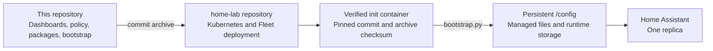

# Home Assistant

Production Home Assistant configuration for a private, family-oriented smart
home. This repository treats dashboards, access policy, custom integrations,
and guarded storage migrations as versioned software while Home Assistant keeps
credentials and mutable runtime state on its persistent volume.

The result is a responsive household interface for shared daily tasks and a
separate administrator surface for infrastructure operations. The deployment
is intentionally opinionated and site-specific, but its architecture and
bootstrap workflow can serve as a reference for other GitOps-managed Home
Assistant installations.

## Highlights

- Responsive family dashboard for desktop, tablet, and phone layouts.
- Account-aware navigation, favorite rooms, calendars, cameras, and health data.
- Nested room pages that keep device controls bounded as rooms gain new devices.
- Senior-friendly Atomberg fan controls with direct speeds, light, sleep, timer,
  unavailable-device guidance, and cloud-quota protection.
- Live UniFi Protect camera wall with policy-controlled visibility, automatic
  activity focus, recent clips, health, alerts, and private speaker messages.
- Concurrent Jellyfin and Music Assistant playback summaries.
- Shared announcements, shopping, calendar agenda, family presence, phone
  status, air quality, weather, and travel-time context.
- Read-only washer status and guarded Bosch dishwasher controls.
- Admin-only Rack dashboard for Home Assistant, Kubernetes, storage, network,
  UPS, and backup health.
- Commit-pinned, checksum-verified frontend assets and custom integrations.
- Idempotent bootstrap with backups before guarded changes to Home Assistant
  storage.

## Design principles

This configuration follows four rules:

1. **Family information comes first.** The Home dashboard presents information
   that helps a household make decisions without exposing routine system noise.
2. **Advanced controls stay close, but subordinate.** Common actions have large,
   direct targets. Less common or risky actions require deliberate interaction.
3. **Access is enforced in the backend.** Lovelace visibility improves the
   experience, but it is not treated as a security boundary.
4. **Source and runtime state remain separate.** Git owns reproducible
   configuration. Home Assistant owns credentials, integration sessions,
   history, list contents, and other mutable state.

The visual composition takes inspiration from
[jlnbln/My-HA-Dashboard](https://github.com/jlnbln/My-HA-Dashboard), adapted for
account-specific household use and responsive layouts.

## Architecture



The companion private home-lab deployment repository pins a commit from this
repository and the SHA-256 of its GitHub source archive. An init container
verifies that archive and runs the bootstrap before Home Assistant starts.
Rancher Fleet owns the Kubernetes deployment; this repository does not contain
cluster credentials or mutate the cluster directly.

Home Assistant runs as one replica with a persistent configuration volume.
Recorder uses a dedicated PostgreSQL database supplied through
`HOME_ASSISTANT_RECORDER_DB_URL`.

## Dashboard surfaces

### Home

The family-facing dashboard combines:

- A personalized greeting and prioritized household briefing.
- Weather, humidity, color-coded air quality, presence, playback, alarms, and
  phone battery status.
- Account-filtered live cameras.
- Active Music Assistant and Jellyfin sessions.
- Upcoming calendar events, announcements, shopping, and media requests.
- Favorite-room summaries ordered per account.
- Shared room, security, and people views.
- Owner-only health and maintenance views.

The layout uses the same information hierarchy at phone, tablet, and desktop
widths. Custom cards provide responsive grids, room routing, announcements,
agenda rendering, appliance controls, fan controls, media summaries, and Seerr
request actions.

### Rooms

`/home-tablet/rooms` provides the room index. Nested routes such as
`/home-tablet/rooms/office` open focused room pages.

Room definitions are declarative. Each room contains independent modules for
fans, appliances, cameras, and media devices, allowing the page to grow without
turning the room index into a control wall. Favorite ordering is personalized,
while room access is currently shared across authenticated family accounts.

### Security and cameras

The combined Security surface presents household attention, five-camera
coverage, account-filtered live streams, recording health, and a seven-day
Protect event timeline in one place. The wall keeps each live player mounted
across Home Assistant state updates, uses medium-resolution streams for its
ambient desktop/tablet grid and low-resolution streams on phones, and switches
only an active camera to high resolution. A current person, vehicle, animal,
sound, or motion event temporarily promotes that camera to the full-width focus
position. Offline cameras remain visible as deliberate status tiles and recover
without a dashboard edit.

The source-owned `family_camera_events` integration subscribes to Protect's
local event WebSocket rather than polling the cloud. It retains at most 20
events per camera, seeds the feed from the previous 24 hours of local Protect
history after startup, and proxies thumbnails and completed clips through
authenticated account-aware endpoints. The dashboard requests short-lived
user-bound signed paths before loading either media type and plays completed
clips in place. Notification bookkeeping is never exposed as entity attributes.
Alerts are deduplicated per Protect event and detection type; historical
backfill never sends an alert.
Smoke, carbon-monoxide, and baby-cry alerts are immediate; person, vehicle, and
animal alerts use the declared empty-home confidence policy. Informational and
advisory alerts respect quiet hours. A clip follow-up is sent only after Protect
marks the event complete.

Camera grants come from the family access policy, and non-owner permissions are
reconciled in Home Assistant's backend. Streams, event history, motion and smart
detection entities, recording diagnostics, and camera speakers inherit the
same grant as their camera, so a restricted room cannot leak metadata or media
through another entity domain. Protect console and NVR storage entities remain
administrator-only. The Master Bedroom camera and speaker are
available to Krishna and the owner. Kitchen, Kitchen Balcony, Living Room, and
Outside are shared with all three family accounts. An owner-only `all_cameras`
capability adds every declared camera to the owner's generated grants without
weakening another account.

The Master Bedroom G4 Instant speaker has an explicit text composer with useful
presets. The backend rechecks the caller's camera grant before using the local
Protect media-player entity, while bootstrap reconciles the zero-credential
Google Translate TTS config entry. Speaker playback requires TCP `7004`
from Home Assistant to the camera. Privacy mode is not surfaced because these
cameras do not currently expose that entity; Protect Alarm Manager remains an
administrator concern rather than a family control.

### Rack

The administrator-only Rack dashboard keeps infrastructure concerns away from
the family interface. It summarizes Home Assistant, Kubernetes, Fleet,
Longhorn, Prometheus, network, UPS, temperature, and database-backup health,
with links to dedicated diagnostic systems.

## Repository layout

| Path | Purpose |
| --- | --- |
| `access/` | Account mappings, room registry, camera grants, household policy, and integration contracts |
| `bootstrap/` | Versions, source URLs, and checksums for external assets and integrations |
| `custom_components/` | Source-owned integrations for household-specific backend behavior |
| `dashboards/` | Family and administrator Lovelace dashboards |
| `location/` | Site-specific home, zone, proximity, and commute definitions |
| `migrations/` | Guarded one-time registry migration inputs |
| `packages/` | Household, commute, infrastructure, and normalization logic |
| `themes/` | The source-owned Family Dark visual system |
| `www/` | Custom Lovelace cards and local frontend resources |
| `tests/` | Bootstrap, integration, dashboard-structure, and responsive browser tests |
| `bootstrap.py` | Standard-library-only installer and reconciler |
| `configuration.yaml` | Authoritative top-level Home Assistant configuration |

## Bootstrap model

Run the bootstrap with a source checkout and a Home Assistant configuration
directory:

```sh
python3 bootstrap.py --source . --config /config
```

The bootstrap:

- Atomically installs source-managed YAML, themes, dashboards, packages, custom
  components, and frontend cards.
- Downloads HACS only when it is missing.
- Verifies pinned frontend assets and custom integration archives before
  installation.
- Reconciles rooms, labels, people, account policy, dashboard defaults,
  location, commute configuration, and the read-only UPS integration.
- Generates browser-safe manifests from backend policy.
- Backs up affected Home Assistant storage files before guarded migrations.
- Removes only files previously recorded as source-managed.
- Preserves UI-owned credentials, integration sessions, shopping data,
  announcements, automations created after the initial migration, and other
  mutable state.

Bootstrap updates can modify files under `/config/.storage`. Test changes
against a disposable configuration directory before applying them to a running
home, and retain the persistent-volume backup created by the deployment.

## External components

`bootstrap/manifest.json` pins and verifies the external frontend and
integration dependencies, including:

- HACS
- Bubble Card
- Button Card
- Navbar Card
- Card Mod
- Kiosk Mode
- Auto Entities
- Todo Swipe Card
- The household Atomberg integration fork

The configuration also expects existing Home Assistant integrations for the
devices and services used by the household, such as UniFi Protect, Google
Calendar, Google Travel Time, Music Assistant, Jellyfin, Home Connect, ThinQ,
mobile companion apps, weather, and NUT. Google Translate TTS is initialized by
bootstrap because it has no credential setup. Other
credentials and config-entry state are not stored in this repository.

## Configuration and secrets

This is the live configuration for one household, not a drop-in starter
template. Before adapting it:

1. Replace the user IDs, usernames, person entities, device trackers,
   notification targets, cameras, calendars, and room entities under `access/`.
2. Replace site and route definitions under `location/`.
3. Review all entity IDs used by `packages/` and `dashboards/`.
4. Supply secrets through the deployment environment or encrypted Kubernetes
   Secrets.
5. Update the source pin and archive checksum in the deployment repository.

The deployment currently supplies:

- `HOME_ASSISTANT_RECORDER_DB_URL`
- `SEERR_API_KEY`
- Private work-location coordinates used during bootstrap

Never commit API keys, passwords, refresh tokens, mobile webhook secrets, or
unencrypted location data that is not intended to be public. Review the
site-specific files in `access/` and `location/` before publishing a fork.

## Development and validation

Run the Python test suite:

```sh
python3 -m unittest discover -s tests -v
```

Run the responsive component suite with Playwright available on `NODE_PATH`:

```sh
NODE_PATH=/path/to/node_modules node tests/mobile_dashboard_components.js
```

The browser suite exercises phone, landscape, tablet, and desktop viewports
using mocked Home Assistant services, so it does not control household devices.
It checks overflow, navigation, responsive reflow, touch-target sizing, room
modules, fan controls, appliance guards, media rendering, agenda interaction,
announcements, Seerr confirmation actions, account-filtered camera walls,
camera-event timelines, and camera-speaker actions.

Before deploying a source revision:

1. Run the Python and applicable browser tests.
2. Commit and push the source change.
3. Calculate the GitHub source archive SHA-256.
4. Update the source commit, archive checksum, and
   `HOME_ASSISTANT_SOURCE_REVISION` in the home-lab Fleet bundle.
5. Validate the rendered Kubernetes resource.
6. Push the deployment change and verify Fleet reconciliation, pod readiness,
   Home Assistant startup logs, and the affected dashboard or integration.

## Operational boundaries

- Kubernetes and network changes belong in the private home-lab repository.
- Home Assistant source changes belong here.
- Credentials and integration sessions remain in encrypted Secrets or Home
  Assistant's persistent storage.
- Recorder excludes raw location and selected private health entities.
- Dashboard conditions improve presentation; backend policy provides access
  control.
- Home Assistant remains a singleton to avoid duplicate automations and shared
  storage contention.
